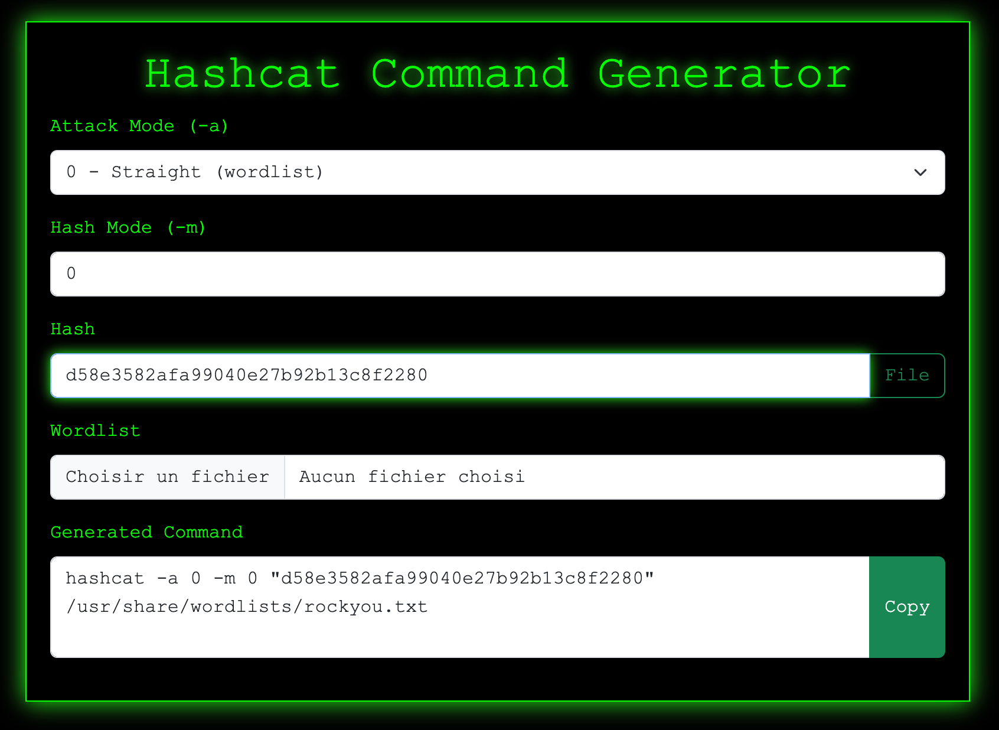
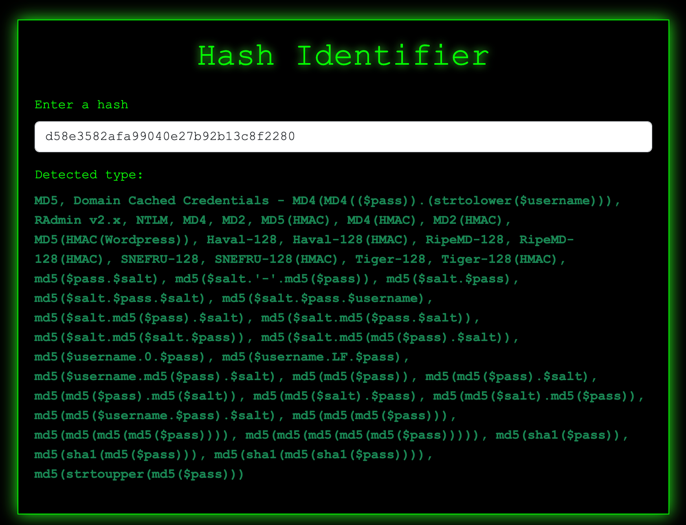

# 0xGen

0xGen is a simple web-based toolset designed for penetration testers and security enthusiasts.
It features several command generators and hash utilities with a hacking-inspired interface.

## Features

- **Hydra Command Generator:**  
  Easily build complex `hydra` commands for HTTP POST brute-force attacks using a user-friendly form.
- **Hashcat Command Generator:**  
  Quickly generate `hashcat` commands for various attack modes and hash types, including support for wordlists, masks, --increment, and --username.
- **Hash Identifier:**  
  Instantly identify the type of a hash (MD5, SHA1, SHA256, etc.) as you type, using a local implementation or the [hash-id-js](https://github.com/tashima42/hash-id-js) library.
- **Dynamic Forms:**  
  Choose between single values or file lists for usernames, passwords, wordlists, and masks. Options and fields adapt to your selections.
- **Live Command Preview:**  
  The command updates automatically as you fill out the form.
- **Copy to Clipboard:**  
  Instantly copy the generated command with a single click.
- **Hacker Style UI:**  
  Dark theme, green monospace text, and terminal-inspired visuals.
- **Responsive Design:**  
  Works on desktop and mobile browsers.

## Usage

1. Open `index.html` in your browser.
2. Click on one of the tools to access:
    - **Hydra http-post-form**
    - **Hashcat**
    - **Hash Identifier**
3. Fill in the required fields for the selected tool.
4. The command or result is generated automatically and updates live.
5. Click **Copy** (where available) to copy the command to your clipboard.

## Online Demo

You can try 0xGen directly in your browser via GitHub Pages:

[https://olivierprotips.github.io/0xGen/](https://olivierprotips.github.io/0xGen/)

## Requirements

- Modern web browser (no backend required)
- [Hydra](https://github.com/vanhauser-thc/thc-hydra) installed on your system to use the generated Hydra command
- [Hashcat](https://github.com/hashcat/hashcat) installed on your system to use the generated Hashcat command

## Preview

  
  
  

## Project repository

## License

MIT License

---
*This project is for educational and authorized testing purposes only.*
