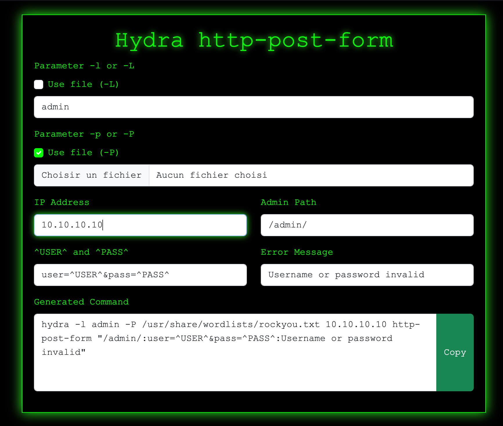

# 0xGen

0xGen is a simple web-based toolset designed for penetration testers and security enthusiasts.  
The main feature is a **Hydra http-post-form command generator** with a hacking-inspired interface.

## Features

- **Hydra Command Generator:**  
  Easily build complex `hydra` commands for HTTP POST brute-force attacks using a user-friendly form.
- **Dynamic Form:**  
  Choose between single values or file lists for usernames and passwords.
- **Live Command Preview:**  
  The command updates automatically as you fill out the form.
- **Copy to Clipboard:**  
  Instantly copy the generated command with a single click.
- **Hacker Style UI:**  
  Dark theme, green monospace text, and terminal-inspired visuals.

## Usage

1. Open `index.html` in your browser.
2. Click on **Hydra http-post-form** to access the generator.
3. Fill in the required fields:
    - Choose between single value or file for username (`-l`/`-L`) and password (`-p`/`-P`).
    - Enter the target IP, admin path, POST parameters, and error message.
4. The command is generated automatically.
5. Click **Copy** to copy the command to your clipboard.

## Requirements

- Modern web browser (no backend required)
- [Hydra](https://github.com/vanhauser-thc/thc-hydra) installed on your system to use the generated command

## Preview

## License

MIT License
